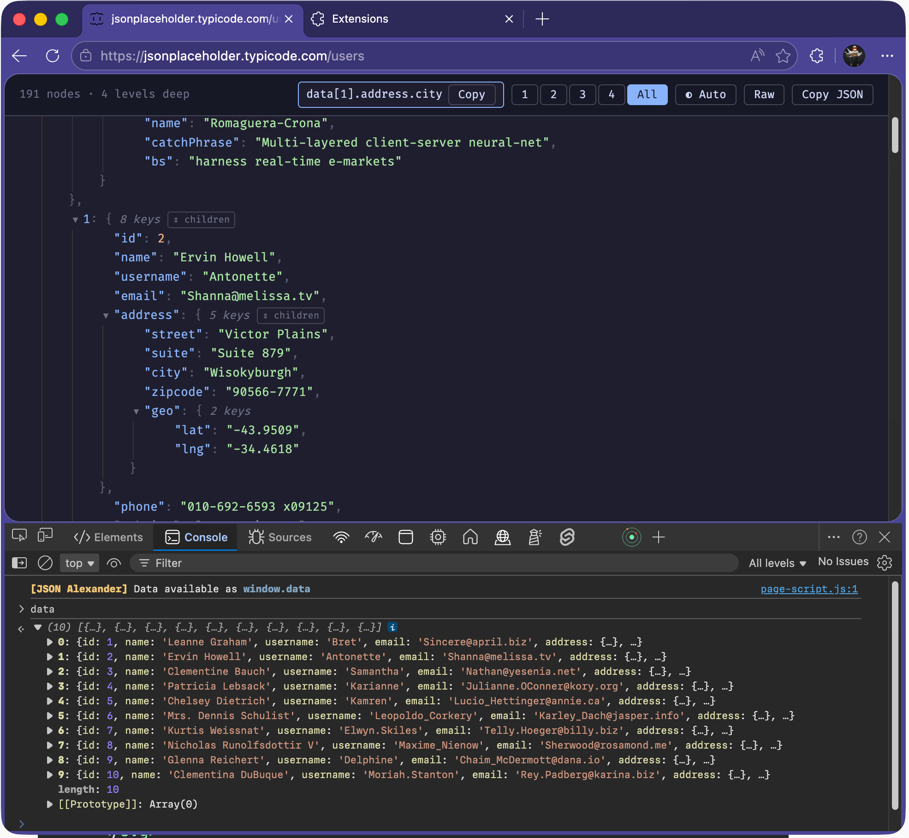

# JSON Alexander


Believe it or not, George formats JSON.



## Features

- Syntax highlighting for keys, strings, numbers, booleans, and null
- Collapsible/expandable tree view with level controls
- Hover any property to see its full JSON path — click to pin, then copy
- Expand/collapse all children of an object with inline button
- View raw JSON or copy to clipboard
- JSON payload available in the console as `window.data`
- Light, dark, and auto (system) themes
- Indent guide lines with hover highlighting

## Installation

1. Open Chrome and navigate to `chrome://extensions`
2. Enable **Developer mode** (toggle in the top right)
3. Click **Load unpacked**
4. Select the **`dist`** folder inside this project

## Development

```bash
npm run dev    # watch mode — rebuilds on file changes
npm run build  # production build
```

After making changes, go to `chrome://extensions` and click the reload button on the extension.

## Usage

Navigate to any URL that returns JSON (e.g. `https://jsonplaceholder.typicode.com/users`). The extension automatically detects JSON responses and replaces the page with an interactive viewer.

- **Level buttons** (1, 2, 3... All) — collapse/expand the tree to a specific depth
- **Theme toggle** — cycle between auto, dark, and light
- **Raw** — toggle between tree view and raw pretty-printed JSON
- **Copy JSON** — copy the full JSON to clipboard
- **Click any line** — pins the JSON path in the toolbar, click Copy to copy it
- **Console** — the parsed JSON is available as `window.data`
